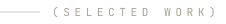
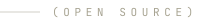
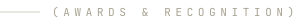
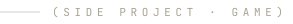

  

 

I build the pipelines behind the pictures. Generative AI, ComfyUI workflows, model
optimization and AI/CGI hybrid production — for agencies, platforms and artists who
want work that ships, not just demos.

- **AI Production Engineer** at Grabarz & Partner (part-time, Omnicom Group) — bringing generative AI into live advertising production
- **Freelance AI Engineer & Consultant** for startups and studios worldwide — ComfyUI pipelines, LoRA training, model optimization
- **Author** of *Stable Diffusion — Ein umfassender Leitfaden über Bildgenerierung und Modelltraining*
- **Artist** — exhibited at FILE Festival 2024, QUBIT AI, FIESP Cultural Center, São Paulo

 

 

| | |
|---|---|
| **Artificial Emotions** | Stiftung Deutsche Depressionshilfe · Gold Tower, NYF LTX 2026 |
| **Porsche** | AI/CGI hybrid R&D and configurator work |
| **Burger King** | Generative campaign production |
| **The Masked Singer** | FOX TV · character and clue films |
| **Hyundai Santa Fe — Open For More** | ADC Bronze, German Digital Award Bronze, Webby Honoree |
| **E.ON Ugly Sweater** | Generative Christmas campaign with Jung von Matt |

<a href="https://www.denrakeiw.com/#work"><b>See the cases →</b></a>

 

ComfyUI tooling people actually install.

  
  

  
  

Also: [**flux_3_api**](https://github.com/DenRakEiw/flux_3_api) — BFL Flux 3 video API nodes with an LLM prompt generator ·
[**Skills**](https://github.com/DenRakEiw/Skills) — agent skills for AI video direction ·
[**scumble**](https://github.com/DenRakEiw/scumble) — desktop inpainting editor driven by your own ComfyUI

 

  
  

Beyond GitHub — the models are on Civitai:

 

- 🏆 **Gold Tower** — New York Festivals LTX Competition **2026**, *Artificial Emotions* with Grabarz & Partner
- 🥇 **#1 Vehicle Creators** leaderboard — Civitai, legendary placement
- 🥉 **#3 Tool Creators** leaderboard — Civitai, legendary placement
- 🏅 **ComfyUI Workflow Contest Winner** — OpenArt.ai, 2024
- 🥉 **Bronze — ADC Germany** · **Bronze — German Digital Award** · **Webby Honoree** — Hyundai Santa Fe
- 🖼️ **FILE Festival — QUBIT AI**, FIESP Cultural Center, São Paulo, 2024

 

**GPU Poor** — you freelance as an AI artist with a dying GTX 1060, a basement room and
rent due every Friday. Generate → upscale → repair, and every step costs hours you do not
have. Built in a week with AI agents, in Godot 4, with three endings and a sandbox.

The desktop build hands its image generation to a **real ComfyUI on your own machine** —
generate, upscale and inpaint all go out to your GPU.

<a href="https://denrakeiw.itch.io/gpu-poor"><b>Play the pre-alpha, free in the browser →</b></a>

 

  
  
  
  
  
  

Artwork generated from <code>assets/</code> — typeset in Instrument Serif and JetBrains Mono, the same faces as <a href="https://www.denrakeiw.com">denrakeiw.com</a>.
