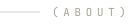
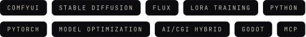
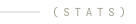
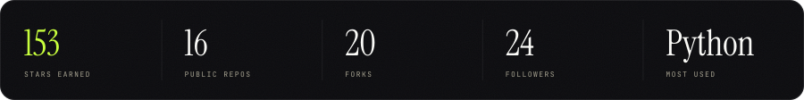
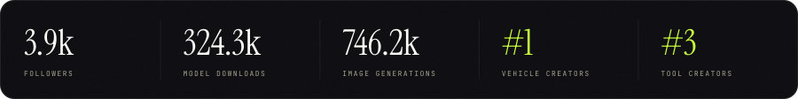
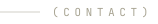

  

 

I build the pipelines behind the pictures. Generative AI, ComfyUI workflows, model
optimization and AI/CGI hybrid production — for agencies, platforms and artists who
want work that ships, not just demos.

 

 

Beyond GitHub — the models are on Civitai:

 

  
  
  
  
  

