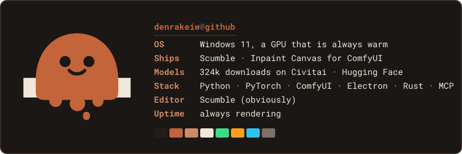

<a href="https://github.com/DenRakEiw/scumble">
  
</a>

### `> now shipping: scumble`

<a href="https://github.com/DenRakEiw/scumble">
  
</a>

<p>
  <a href="https://github.com/DenRakEiw/scumble"></a>
  <a href="https://github.com/DenRakEiw/scumble/releases/latest"></a>
  <a href="https://github.com/DenRakEiw/scumble/releases"></a>
  <a href="https://github.com/DenRakEiw/scumble/blob/main/LICENSE"></a>
  <a href="https://github.com/DenRakEiw/scumble#agents-can-drive-it"></a>
</p>

```diff
+ inpaint, edit, upscale, generate: every edit comes back as a layer of its own
+ boxes in the prompt: draw where things go, write what goes in each box
+ your own ComfyUI, Comfy Cloud, or just your API keys (FLUX 3, GPT Image, Nano Banana ...)
+ 105 MCP tools: Claude Code or any other agent drives the same window, with the same undo
+ 46 film looks, colour match per layer, PSD and ORA export with layers
+ free and open source, GPL-3.0
- accounts, subscriptions
```

**[⭐ Star it](https://github.com/DenRakEiw/scumble)** &nbsp;·&nbsp; **[⬇ Download](https://github.com/DenRakEiw/scumble/releases/latest)** &nbsp;·&nbsp; **[Microsoft Store](https://apps.microsoft.com/detail/9NDBTNNMXF2R)** &nbsp;·&nbsp; **[Manual, videos, dev blog](https://www.denrakeiw.com/scumble)**

### `> neofetch`



### `> git log --graph --all`


### `> ping`

<p>
  <a href="https://www.denrakeiw.com/scumble"></a>
  <a href="https://www.linkedin.com/in/dennis-schoeneberg/"></a>
  <a href="https://civitai.com/user/denrakeiw"></a>
  <a href="https://huggingface.co/DenRakEiw"></a>
  <a href="https://denrakeiw.itch.io"></a>
</p>
